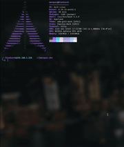

# create-webview-cli

<p align="center">
  <pre>
  __        __   _  __     ___                     ____ _     ___ 
  \ \      / /__| |_\ \   / (_) _____      __     / ___| |   |_ _|
   \ \ /\ / / _ \ '_ \ \ / /| |/ _ \ \ /\ / /____| |   | |    | | 
    \ V  V /  __/ |_) \ V / | |  __/\ V  V /_____| |___| |___ | | 
     \_/\_/ \___|_.__/ \_/  |_|\___| \_/\_/       \____|_____|___|
  </pre>
  <sub>jmarquez.dev</sub>
</p>

<p align="center">
  <a href="https://www.npmjs.com/package/create-webview-cli">
    
  </a>
  <a href="https://www.npmjs.com/package/create-webview-cli">
    
  </a>
  <a href="https://github.com/jmarquezruiz/webview-cli/blob/master/LICENSE">
    
  </a>
</p>

<p align="center">
  
</p>

## Overview

`create-webview-cli` is a command-line tool that helps you quickly scaffold new Expo applications with WebView integration. It's designed to streamline the process of creating mobile apps that display web content within a native WebView component.

## Features

- ⚡ **Fast Setup** - Generate a complete Expo WebView project in seconds
- 🎨 **Customizable** - Configure app name, package name, and WebView URL
- 🖼️ **Icon Support** - Optional custom app icons
- 📦 **Flexible Dependencies** - Choose your preferred package manager (pnpm, npm, yarn)
- 🎯 **TypeScript Ready** - Built with TypeScript for type safety
- 💅 **Beautiful CLI** - Modern command-line experience with colors and spinners

## Installation

```bash
pnpm create webview-cli@latest
```

Or use npx:

```bash
npx create-webview-cli@latest
```

## Usage

Run the CLI without arguments to start the interactive prompt:

```bash
pnpm create webview-cli
```

The CLI will guide you through:

1. **App Name** - Display name for your application
2. **Project Folder** - Directory name for the generated project
3. **Package Name** - Android/iOS package identifier (e.g., `com.company.app`)
4. **WebView URL** - The URL to load in the WebView
5. **Custom Icons** - Option to add custom app icons
6. **Install Dependencies** - Choose whether to install dependencies
7. **Package Manager** - Select your preferred package manager

## Generated Project

The CLI generates a complete Expo project with:

- `app.json` - Expo configuration with your app settings
- WebView component - Ready-to-use WebView integration
- Asset handling - Icons and splash screen support
- All Expo dependencies pre-configured

## Quick Start

After generating your project:

```bash
cd your-project-name
pnpm install
pnpm expo install
pnpm start
```

## Requirements

- Node.js 18+
- pnpm (recommended), npm, or yarn
- Expo CLI (installed automatically)

## Tech Stack

- **Node.js** - JavaScript runtime
- **TypeScript** - Type-safe JavaScript
- **Commander** - CLI framework
- **@clack/prompts** - Modern prompts
- **Kleur** - Terminal colors
- **Ora** - Loading spinners
- **Figlet** - ASCII banners

## Development

```bash
# Install dependencies
pnpm install

# Build the project
pnpm build

# Run in development mode
pnpm dev

# Link for local testing
npm link
create-webview-cli
```

## License

MIT License - feel free to use in your projects.

---

<p align="center">Made with ❤️ by <a href="https://jmarquez.dev">jmarquez.dev</a></p>
